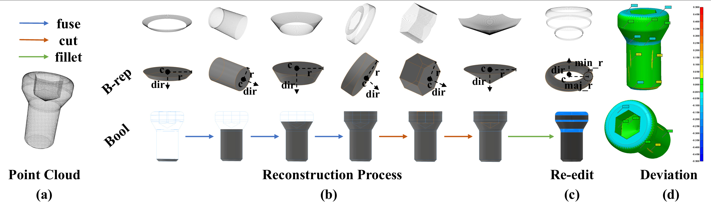
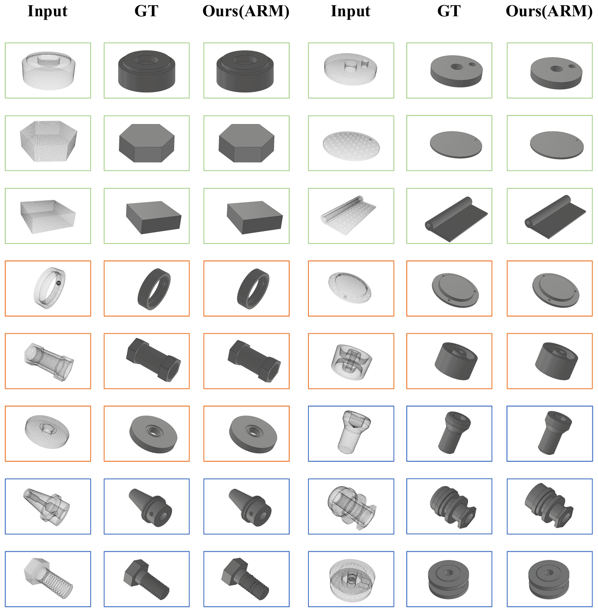

# ARM：A RANSAC-based method for Automatic Reverse Modeling of incomplete point clouds
 
This repository provides source code for our paper:

# Paper Post-Acceptance Code Open-Source Project

This repository hosts some of the key code developed during our research. Since the paper is still under review, we are currently providing a pre-release version of the code only. The complete reproduction steps and related files will be made publicly available once the paper is accepted. Thank you for your interest and understanding!

## Project Overview

- **Pre-release Content:**  
  This repository currently includes a subset of data processing scripts that demonstrate our research approach and framework.
  
- **Future Updates:**  
  Upon the official acceptance of the paper, the full code base including complete reproduction steps, configuration files, and additional documentation will be released. This will facilitate reproducibility and further development by interested researchers.

## Results Overview

The following figure illustrates the visualization results of reverse modeling on the CADParser dataset using the **ARM (Automatic Reverse Modeling)**  

  

*Figure: Each row contains results for two CAD models. For each model, the three columns (from left to right) show the input point cloud, the ground truth CAD model, and the result reconstructed by the ARM method. Models are categorized by
complexity: green frames denote simple models (1–3 primitives), orange frames denote medium models (4–7 primitives), and blue frames denote complex models (8 or more primitives).*

  ## Demo Video
[Demonstration of CloudCompare plugin integrating automatic reverse modelling algorithms.](https://www.bilibili.com/video/BV1VjY4zAEBw/?share_source=copy_web&vd_source=5cf44e7a3a7ad5cdd71a8af3cff15927)

